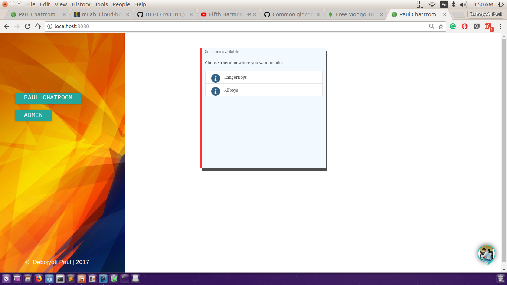
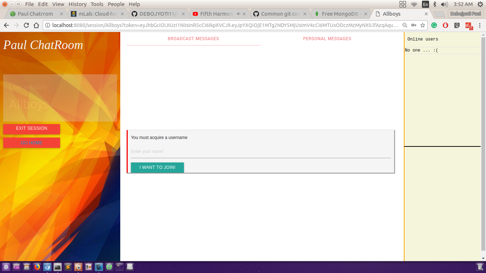
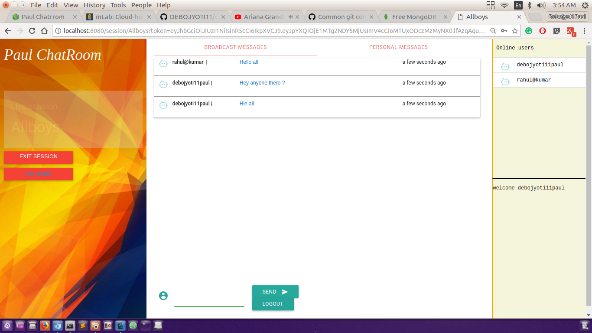

# Chatapp

An Broadcast multiuser chat application build with NodeJs and Socket.io. 
Users can join the app with a passkey and after that can gain a unique username and send messages both broadcast and private. 

* At any moment list of online users can be seen.
* Include features to send a private message to a user along with broadcast.


## Getting Started

Just clone the repo.
Modify the mod/config.js file with your mongodb url,if you are running locally or MLAb url, if your are running on platforms such as heroku.

### Prerequisites
* NodeJs
* npm
* MongoDb

### Mojor Dependencies
* JWt
* Socket.io
* Express.JS

### Installing

```
npm install
```

## Deployment

To deploy on Heroku 
* Create heroku account and then install heroku cli on ubuntu
* Follow [this](https://devcenter.heroku.com/articles/getting-started-with-nodejs#introduction) official tutorial.

## Built With

* [ExpressJs](#) - The web framework used
* [Socket.io](#) - Dependency for socket connection
* [MongoDB](#) - for persisting chat and user info
* [Material CSS](#) - For UI purpose


## Authors

* **Debojyoti Paul** - *Initial work* - [debojyoti11](https://github.com/debojyoti11)

## Screenshots




